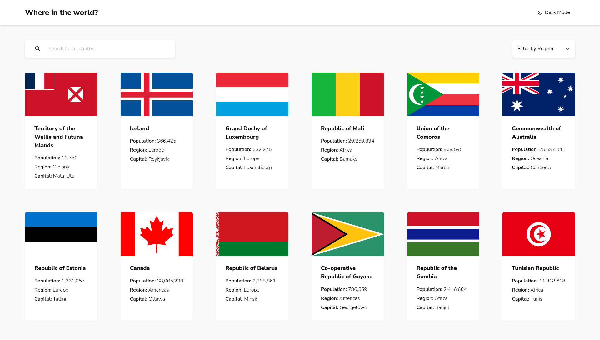
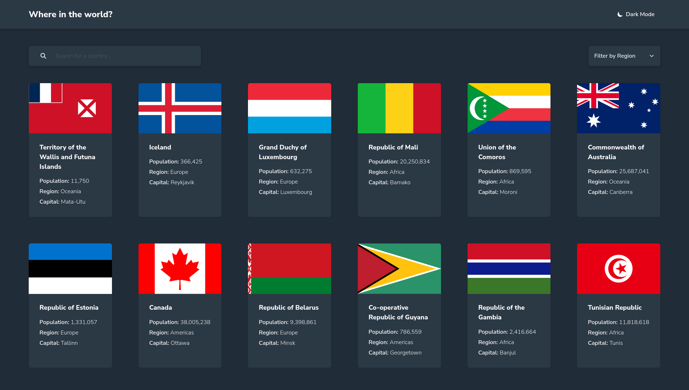
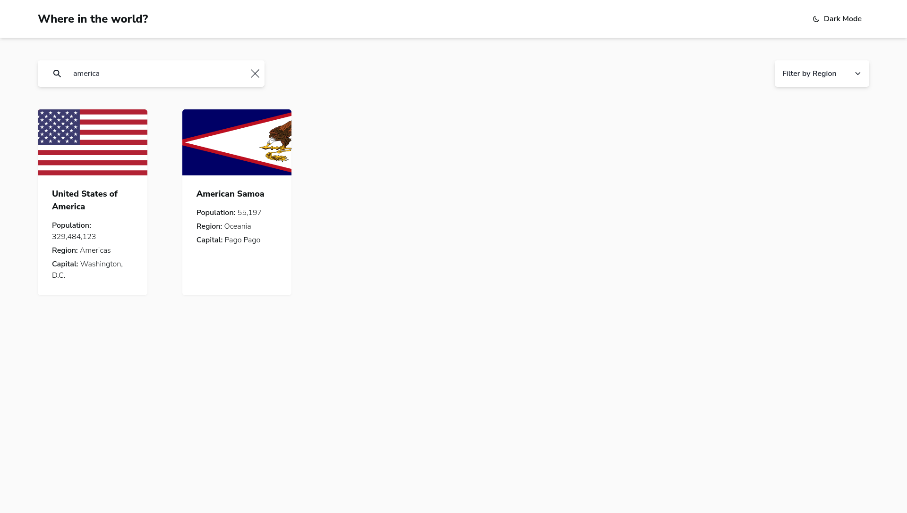
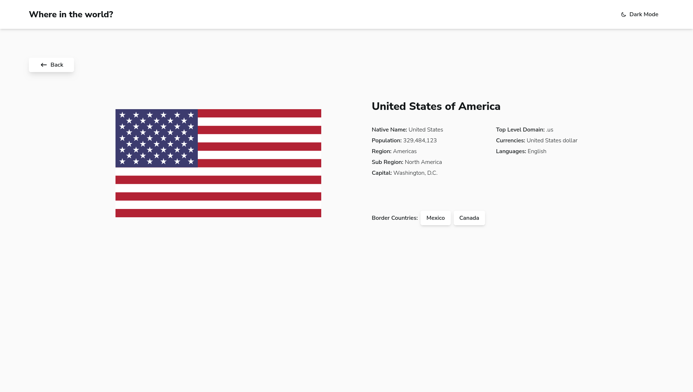

# REST-API Countries Interface

Builds with: [Vite](https://vitejs.dev/), [React](https://react.dev/), [Typescript](https://www.typescriptlang.org/), [Tanstack Query](https://tanstack.com/query/latest), [Tanstack Router](https://tanstack.com/router/latest), and [Chakra UI](https://v2.chakra-ui.com/)

[Live Demo](https://abdelrahman-mh.github.io/rest-countries/)

## Development

- Clone the repo and navigate the project directory:

```bash
git clone https://github.com/abdelrahman-mh/rest-countries
cd rest-countries
```

- Install Dependencies:

```bash
# you can use also pnpm as you need
npm install
```

- Run dev server:

```bash
npm run dev
```

Now open http://localhost:5173/ in you browser

### ToDos 📝

- [ ] Add scroll to top button
- [ ] E2E tests with [Cypress](https://www.cypress.io/)
- [ ] Add custom theme for buttons and inputs, for more lees code in components

### Home page



### Home Page Dark Mode



### Country Search



### Country Details


